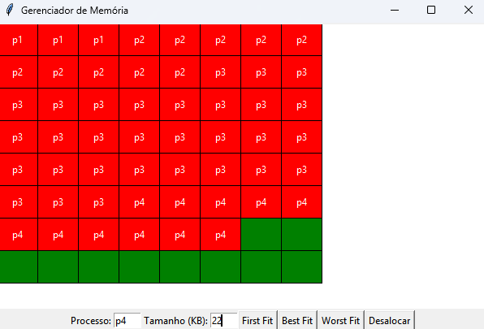

# Gerenciador de Memória – Simulador em Python



## Descrição

Este projeto é um **simulador de gerenciamento de memória** em Python, que divide a memória em blocos de tamanho fixo e permite alocação e desalocação de processos utilizando **algoritmos First Fit, Best Fit e Worst Fit**.
A interface gráfica (GUI) foi implementada em **Tkinter**, mostrando visualmente a memória e os blocos ocupados e livres.

---

## Funcionalidades

* **Divisão de memória em blocos fixos**

  * Memória total: 128 KB
  * Tamanho de cada bloco: 2 KB
  * Cada processo ocupa blocos inteiros (mesmo que o tamanho solicitado seja menor que o bloco).

* **Alocação de processos**

  * Algoritmos suportados:

    * **First Fit**: aloca no primeiro espaço livre contínuo suficiente
    * **Best Fit**: aloca no menor espaço livre contínuo que comporte o processo
    * **Worst Fit**: aloca no maior espaço livre contínuo disponível

* **Desalocação de processos**

  * É possível desalocar qualquer processo manualmente pelo código.

* **Visualização em GUI (Tkinter)**

  * Blocos livres aparecem em **verde**
  * Blocos ocupados aparecem com **cores aleatórias**
  * Cada processo contínuo mantém sua **cor fixa** enquanto estiver alocado

* **Display textual**

  * Função `display()` imprime no terminal o estado atual da memória, mostrando quais blocos estão livres e quais estão ocupados.

---

## Estrutura do Projeto

```
gerenciador-de-memoria/
│
├── block.py           # Classe Block que representa cada bloco de memória
├── memoryManager.py   # Classe MemoryManager com lógica de alocação/desalocação
├── gui.py             # Interface gráfica em Tkinter
└── main.py            # Script principal para testar o simulador
```

---

## Como Usar

1. Clone o projeto:

```bash
git clone https://github.com/Yuri-Diego/memory-manager.git
cd gerenciador-de-memoria
```

2. Execute o simulador com Python 3.13 ou superior:

```bash
python main.py
```

3. A GUI será aberta mostrando a memória:

   * Blocos verdes → livres
   * Blocos coloridos → ocupados por processos

---

## Observações

* **Alocação parcial**: cada processo ocupa blocos inteiros; se o processo não preencher um bloco totalmente, o restante do bloco não pode ser usado por outro processo.
* **Desalocação automática** ainda não está implementada. Atualmente, os processos devem ser desalocados manualmente usando `deallocate(process)`.

---

## Dependências

* Python 3.13 ou superior
* Tkinter (geralmente já incluso no Python padrão)

---

## Próximos Passos

* Implementar **desalocação automática** quando não houver espaço suficiente.
* Adicionar botões na GUI para **alocar e desalocar processos manualmente**.
* Melhorar visualização para mostrar nomes dos processos centralizados em blocos grandes.
